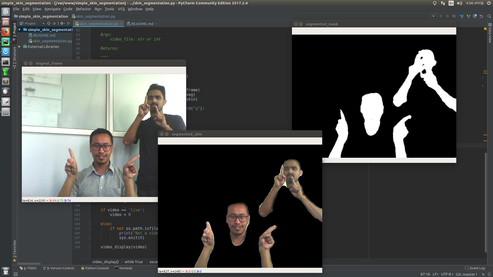
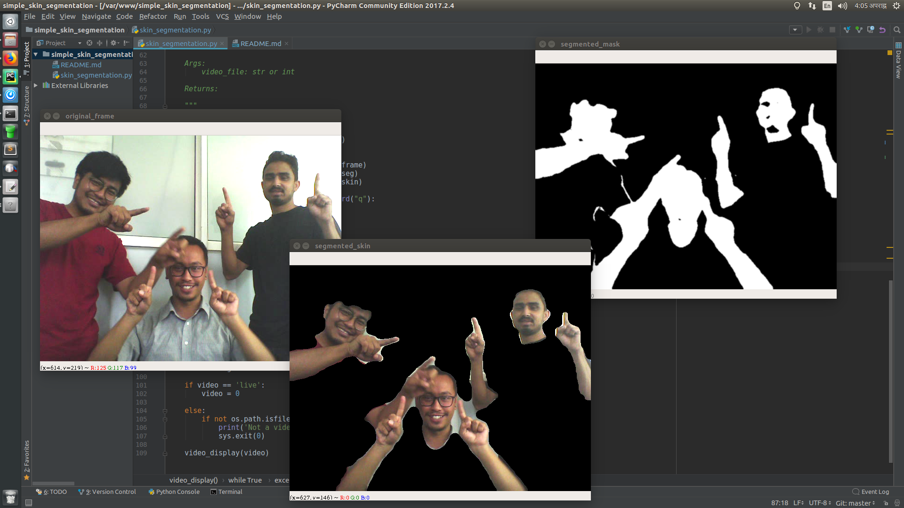

# Simple skin segmentation in videos

## Requirements
`opencv`
`numpy`

## Run 
##### For live video
`python skin_segmentation.py`
##### For video file
`python skin_segmentation.py --video <video_file_name>`

## Result

## Limitations
- Treats skin-like-colors as skin
- Is not suitable for all skin types

